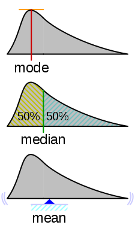

Descriptive Statistics
======================

Measuring Location
------------------

    src: wikipedia/probability_density_function

Mean
    Sum observations / number of observations
Median
    Central Value (less sensitive to outliers)
Mode
    Most common value

Measuring Variability
---------------------
Range
    Largest observation – smallest observation
Quantiles
    Split data like into equally numbered groups. Median into two, quartiles into 4
Interquartile Range
    Range between top and bottom quartile. Shows where the middle 50% of the data lies. Not influenced by outliers
Standard Deviation
    Average deviation from the mean. Measures homogeneity of individual values.
    :math: std = \sqrt( (\sum(xi-xm)^2)/(n-1) )
Variance
    :math: std^2

Or if you want to write inline you can use this:  :math:`\\frac{ \\sum_{t=0}^{N}f(t,k) }{N}`

Distributions
-------------
Normal (=Gaussian) distribution
    Most common, unimodal, symmetrical.
    Other distributions tend to normalize when we increase sample size.
    Entirely defined by two parameters: means and std.

.. figure:: img/normalDistribution.png
    :figwidth: 300px
    :align: center

    src:wikipedia/Normal_distribution

Central Limit Theorem
    given certain conditions, the arithmetic mean of a sufficiently large number of iterates of independent random variables, each with a well-defined expected value and well-defined variance, will be approximately normally distributed, regardless of the underlying distribution.
 
Law Of Large Numbers
    As a sample size grows, its mean will get closer and closer to the average of the whole population.
 
Standard error (SE)
    Standard deviation of the sampling distribution of a statistic, most commonly of the mean. It can be seen as how far the sample mean is likely to be from the population mean
    :math: SE = std(xi)/\sqrt(#xi)

95% Confidence Interval
    Range in which 95% of the true population mean is likely to lie.
    CI = [SampleMean-1.96*SE , SampleMean+1.96*SE]
    May not be good for small sample sized and very non normal distributions. In that case we can use the t-distribution to replace the 1.96
