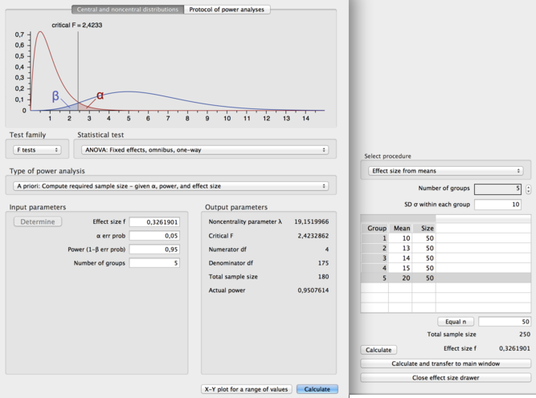

Useful Tools
============

G*Power: Statistical Power Analyses
-----------------------------------

G*Power is a tool to compute statistical power analyses for many different t tests, F tests,
χ2 tests, z tests and some exact tests. G*Power can also be used to compute effect sizes and to
display graphically the results of power analyses.

http://www.gpower.hhu.de/

