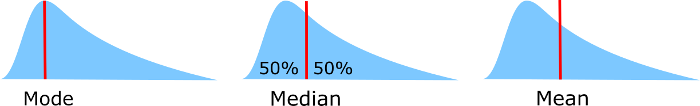
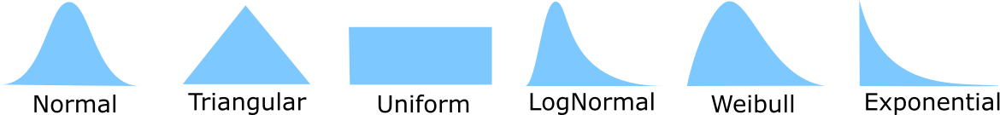
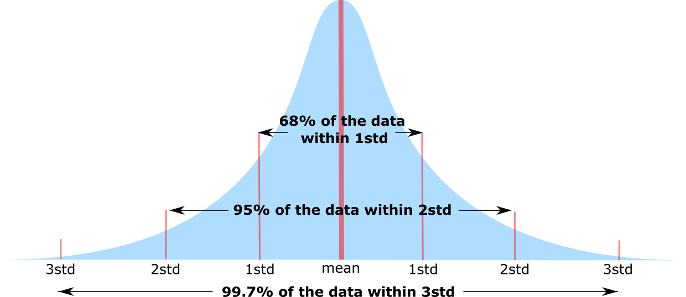

Descriptive Statistics
======================

Measuring Location
------------------

Mode
    Most common value
Median
    Central Value (less sensitive to outliers)
Mean
    Sum observations / number of observations

Measuring Variability
---------------------
Range
    Largest observation – smallest observation
Quantiles
    Split data like into equally numbered groups. Median into two, quartiles into 4
Interquartile Range
    Range between top and bottom quartile. Shows where the middle 50% of the data lies. Not influenced by outliers
Standard Deviation
    Average deviation from the mean. Measures homogeneity of individual values.

    .. math::
            std = \sqrt{\frac{\sum(x_i-x_{mean})^2}{n-1}}

Distributions
-------------

    Some distributions

Normal (=Gaussian) distribution
    Most common, unimodal, symmetrical.
    Other distributions tend to normalize when we increase sample size.
    Entirely defined by two parameters: means and std.

    Normal Distribution

See the :ref:`statisticalTests` section for info on testing or visualizing a distribution vs another.

Law Of Large Numbers
    As a sample size grows, its mean will get closer and closer to the average of the whole population.
 
Standard Error
    Standard deviation of the sampling distribution of a statistic, most commonly of the mean. It can be seen as how far the sample mean is likely to be from the population mean

    .. math::
        SE =  \frac{std}{\sqrt{n}}

95% Confidence Interval
    Range in which 95% of the true population mean is likely to lie.

    .. math::
        CI = [mean-1.96*SE , mean+1.96*SE]

    May not be good for small sample sized and very non normal distributions. In that case we can use the t-distribution to replace the 1.96
