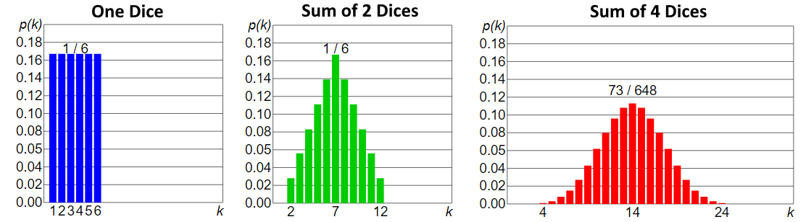

Descriptive Statistics
======================

Measuring Central Tendency
--------------------------

.. figure:: img/modeMedianMean.png
    :figwidth: 600px
    :align: center

Mode
    Most common value
Median
    Central Value (less sensitive to outliers)
Mean
    Sum observations / number of observations

Measuring Variability
---------------------
Range
    Largest observation – smallest observation
Quantiles
    Split data like into equally numbered groups. Median into two, quartiles into 4
Interquartile Range 
    Range between top and bottom quartile. Shows where the middle 50% of the data lies. Not influenced by outliers
Standard Deviation
    Average deviation from the mean. Measures homogeneity of individual values.

    .. math::
            std = \sqrt{\frac{\sum(x_i-x_{mean})^2}{n-1}}

Distribution
------------
.. figure:: img/distributions.png
    :figwidth: 600px
    :align: center

    Some distributions

Normal (=Gaussian) distribution
    Most common, unimodal, symmetrical.
    Other distributions tend to normalize when we increase sample size.
    Entirely defined by two parameters: means and std.

.. figure:: img/normalDistribution.png
    :figwidth: 500px
    :align: center

    Normal Distribution

See the :ref:`statisticalTests` section for info on testing or visualizing a distribution vs another.

Law Of Large Numbers
    As a sample size grows, its mean will get closer and closer to the average of the whole population.
 
Central Limit Theorem
    In probability theory, the central limit theorem (CLT) establishes that, in some situations, when independent random variables are added, their properly normalized sum tends toward a normal distribution even if the original variables themselves are not normally distributed. The theorem is a key concept in probability theory because it implies that probabilistic and statistical methods that work for normal distributions can be applicable to many problems involving other types of distributions.

    Central Limit Theorem (wiki)

Standard Error
    Standard deviation of the sampling distribution of a statistic, most commonly of the mean. It can be seen as how far the sample mean is likely to be from the population mean

    .. math::
        SE =  \frac{std}{\sqrt{n}}

95% Confidence Interval
    For a gaussian distribution, the range in which 95% of the true population mean is likely to lie is defined by:

    .. math::
        CI = [mean-1.96*\frac{std}{\sqrt{n}} , mean+1.96*\frac{std}{\sqrt{n}}]
        
1.96 can be replaced by other values for different percentages: 99%:2.576, 98%:2.326, 95%:1.96, 90%:1.645

    May not be good for small sample size (<30) and very non normal distributions. In that case we can use the t-distribution to replace the 1.96
    

Correlation
-----------
See :ref:`statisticalTests` to choose the appropriate method.
TODO ADD MEAT TO CORRELATION

Per Cohen (1992, Power primer):
    0.0 < abs(corr) <  0.3: Weak
    0.3 < abs(corr) <= 0.5: Moderate
    0.5 < abs(corr) <= 0.9: Strong
    0.9 < abs(corr) <= 1.0: Very strong

We can use a scatter plot to visualize correlation.
