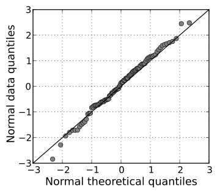

.. _statisticalTests:

Statistical Tests
=================

Test for Normality
------------------

    src:wikipedia/Q–Q_plot

    QQ plot of random normal data against a normal distribution

To get an indication on the shape of a distribution, or to compare to a given distribution,
we can plot a histogram or a QQ-plot (quantile-quantile).
When plotting a QQ-plot against a normal distribution, if all the samples fall close to the reference line, we can assume normality.

<ADD STATISTICAL TESTS FOR NORMALITY FROM ONENOTE>

Examples of Test Selection
--------------------------
Is there a statistically significant relationship between participants’ level of education (high school, bachelor’s, or graduate degree) and their starting salary?
    Spearman
Is there a statistically significant relationship between horse’s finishing position a race and horse’s age?
    Spearman
